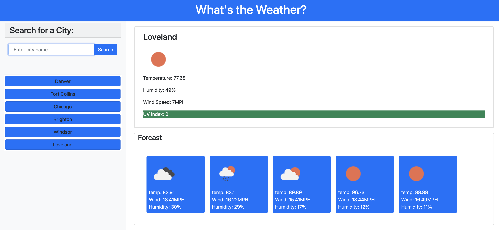

# Weather_App

Deployed site: https://michlimones.github.io/Weather_App/

Weather app to check the weather for a specific city.

The weather forcast for the day will provde the user with a UV Index and color coded if the conditions are favorable, moderate, or severe.

The app will also provide the user with the forcsat for the next 5 days.

The user can search a new city or may select a previous city.

Results are saved to the user's local storage
